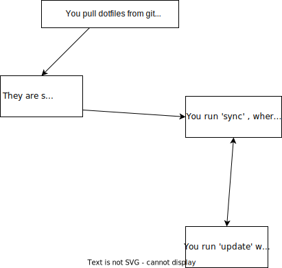

<h1 align="center">tsdm

[](https://goreportcard.com/report/github.com/pandademic/tsdm)

<p>(The Simple Dotfile Manager)</p>
<h1>


## Architecture

Tsdm manages your dotfiles without symlinks , like so:

[](assets/architecture.svg)


You configure how tsdm manages your dotfiles , with a `tsdmrc.yml` file in your dotfile repo.

Example:

```yaml
reqVer: 0.1 # what is the minimum tsdm version these dotfiles need
windows: # OS block. The following instructions will only be executed on this OS
  files:
     - pwsh.txt: # name of the file.This is case senstive , tsdm parses the names of the files in dotfile directory , and looks for the data in the rc file 
        name: "powershell note" # this is used for info prinintg
        location: ~/foo/bar/pwsh.txt # where to copy it to on sync. Yes , it supports tilda's
        commentary: "this is optional , TSDM doesn't use it , its good for readability"
# etc. OS blocks

```

for a real world example , check [my dotfiles](https://github.com/pandademic/dotfiles).

## Commands
There are a few commands in tsdm:
- `-h` <- show help. Accepts: nothing
- `help` <- show help. Accepts: nothing
- `-v` <- show the tsdm version. Accepts: nothing
- `version` <- show the tsdm version. Accepts: nothing
- `update` <- run a git pull on the current dotfiles. Accepts: nothing
- `get` <- get a new set of dotfiles , replacing the old one.Accepts: A URL including the protocol(https)
Ex: `https://github.com/pandademic/tsdm-example`
- `sync` <- sync the dotfiles to the correct locations. Accepts: nothing
## Installation
You have 3 choices:
- Build it yourself.We use [task](https://taskfile.dev/), instead of make. Just run `task` to see all avilable tasks.
  
- Download a prebuild binary from github releases. 

- or run `go install tsdm@[version]` from the command line , where `[version]` is the released version , ex: `go install tsdm@0.1`

## Licence

[MIT](https://github.com/Pandademic/tsdm/blob/main/LICENSE)
